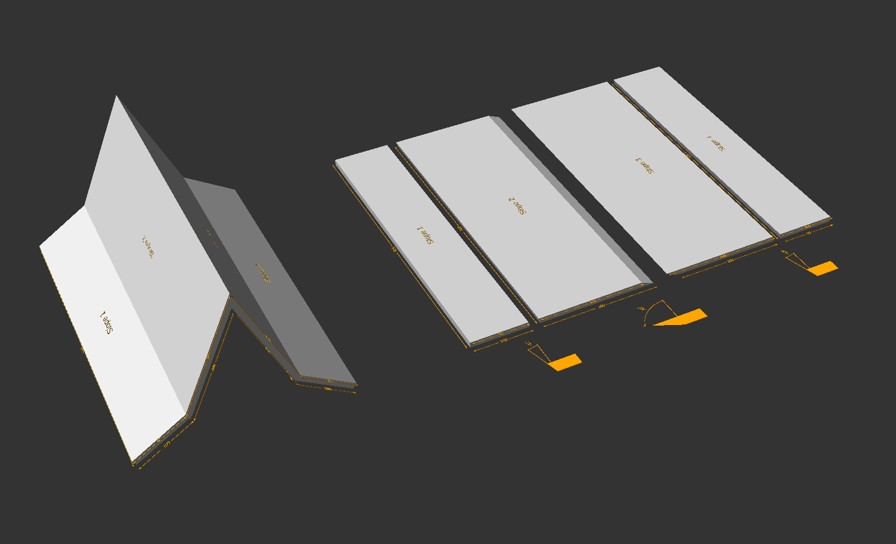
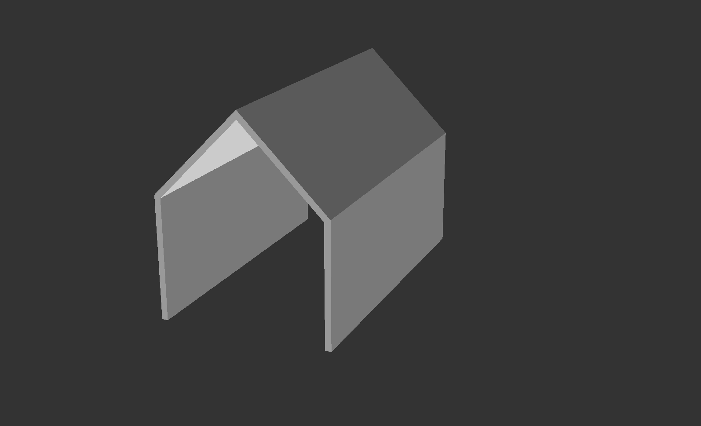

# The Roof Is On Fire

An OpenSCAD library for designing roofs and their corresponding blueprints, for woodworking projects.



## Installation

1. Download the .zip or .tar.gz release file for this library.
2. Extract the archive. This will create an `openscad-roof-on-fire` directory containing the library files.
3. Move the `openscad-roof-on-fire` directory to the appropriate OpenSCAD library directory for your platform:
   - Windows: My Documents\OpenSCAD\libraries\
   - Linux: $HOME/.local/share/OpenSCAD/libraries/
   - macOS: $HOME/Documents/OpenSCAD/libraries/
4. Install the `openscad-new-dimensions` library by following its [installation instructions](https://codeberg.org/adrien-delhorme/openscad-new-dimensions)
5. Restart OpenSCAD.

## Documentation

This library enables you to design roof shapes in 3D and automatically generates a flat view with each component laid out side by side. You can also display dimensions and cutting angles overviews.

### Include library

```scad
include <openscad-roof-on-fire/roof.scad>
```

### Usage

To create a roof, you need to define a list of slopes (a `slopes_vector`). Each slope in this vector is described by:
- `dimensions`: [`length`, `width`, `material_thickness`] the dimensions of the slope
- `angle`: the angle between the x axis and the slope
- `label`: an optional custom label

The `render_mode` and `show_angles` parameters will override settings values for that instance only.

```scad
Roof([
  [[200, 300, 10], -90, "Wall left"],
  [[200, 300, 10], -45, "Slope left"],
  [[200, 300, 10], 45, "Slope right"],
  [[200, 300, 10], 90, "Wall right"]
]);
```


### Settings

**ROOF_RENDER_MODE** (default: "3D")<br>
Choose the rendering mode: 3D, Flat, or 2D.<br>
The Flat mode lays out each piece on a plan to create a blueprint-like representation. Pieces are still in 3D.
The 2D mode may be used if you need to work on a 2D-only project. It is also suitable when exporting SVG/DWG for laser cutters.

**ROOF_RENDER_GAP_FLAT** (default: 20)<br>
Space between each individual component in Flat render mode.

**ROOF_SHOW_DIMENSIONS** (default: false)<br>
Whether to show dimensions when rendering.

**ROOF_DIMENSION_GAP** (default: 5)<br>
Space between dimensions and elements.

Additional settings for customising dimension rendering may be found in the `openscad-new-dimensions` project's documentation.